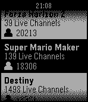
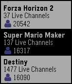
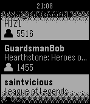
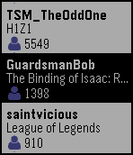

# Twibble

## Description

Keep up to all your favorite streamers with Twibble, the Twitch Pebble app!

Features include:
- Checking which of your followed streamers is online by signing in through app settings on your phone
- Viewing the top live streams
- Seeing which games are popular, and who is currently showing them

## Screenshots

Aplite | Basalt
------------- | -------------
 | 
 | 
 | 

## Building and Installing

### Pebble SDK Version
Built and tested using version 3.4

### Platforms
App has been tested on the Aplite platform (Pebble Classic B&W watch).
The app should function on the Basalt platform (Pebble Time & Pebble Time Steel) as well, however it has only been tested via emulation.
If you try it on these watches, please send us some feedback.
[Link to App (TODO)](link)

## Privacy
User login information required to retrieve user's list of followed channels and display username.
Interaction with Twitch user services is provided using [Twitch's OAuth authentication](https://github.com/justintv/Twitch-API/blob/master/authentication.md)

## Disclaimer
We have no affiliation with Twitch Interactive, Inc.

Use of the Twitch API is in accordance with the [following guidelines](http://www.twitch.tv/user/legal?page=api_terms_of_service)
