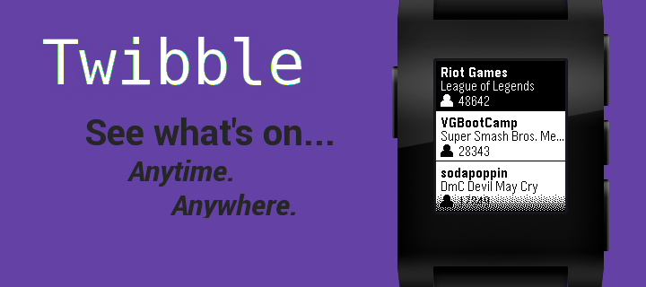
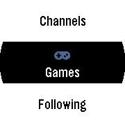
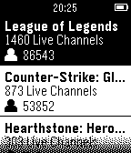
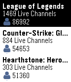
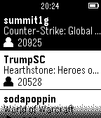
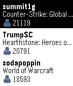
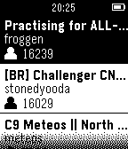
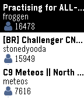

# Twibble



## Description
Keep up to all your favorite streamers with Twibble, the Twitch Pebble app available [on the Pebble App Store.](http://apps.getpebble.com/en_US/application/5620481225ef793e5a00001a)

Features include:
- Checking which of your followed streamers is online by signing in through app settings on your phone
- Viewing the top live streams
- Seeing which games are popular, and who is currently showing them

Looking to contribute? That's great. We're always looking for contributions via the issue tracker and bug tracker. For suggestions on features, please use the feature request. If you find an error in the source code, file an issue or send a pull request.
## Screenshots

Aplite | Basalt | Chalk
------------- | ------------- | ------------- 
 |  | 
 |  | 
 |  | 
 |  | 

## Building and Installing

### Platforms
The program has been compiled with SDK 3.7 and tested on Basalt (Pebble Time/Time Steel) platforms.
While the program seems to behave as expected on the Aplite (Pebble OG) and Chalk (Pebble Time Round) emulators, feedback on the app's performance on these platforms is appreciated.

### Sideloading the app
```bash
# Make sure developer mode is active on your phone and then establish connection
$ Pebble login
# Deletes all current build files in preparation for a clean build
$ Pebble clean
# Install the watchapp on your Pebble
$ Pebble install --cloudpebble
```

## Privacy
User login information required to retrieve user's list of followed channels and display username.
No information about the user is stored by the program.
Interaction with Twitch user services is provided using [Twitch's OAuth authentication](https://github.com/justintv/Twitch-API/blob/master/authentication.md)

## Disclaimer
We have no affiliation with Twitch Interactive, Inc.

Use of the Twitch API is in accordance with the [following guidelines](http://www.twitch.tv/user/legal?page=api_terms_of_service)
